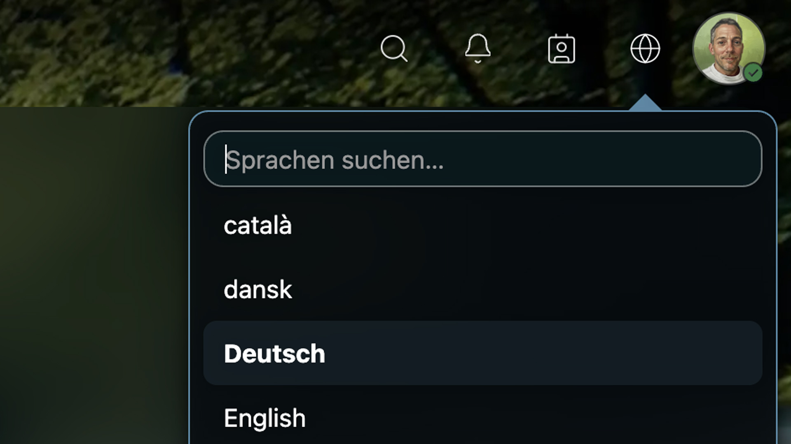

# Language Switcher for Nextcloud

[](https://nextcloud.com)
[](https://www.gnu.org/licenses/agpl-3.0)

A Nextcloud app that adds a language switcher to the header bar, allowing users to change the interface language on the fly — for both logged-in users and visitors on public share pages.



## Features

- Switch language directly from the header bar — no need to visit settings
- Works for logged-in users — saves the selected language as user preference
- Works on public share pages — visitors can choose their language via session cookie
- Admin settings — choose from 6 icon styles, adjust size, stroke width and color
- Language filter — admins can restrict which languages are available
- Supports 100+ languages out of the box
- Compatible with Nextcloud 27–33
- Full dark mode support

## Installation

### From the Nextcloud App Store

1. Go to **Apps** in your Nextcloud admin panel
2. Search for "Language Switcher"
3. Click **Download and enable**

### Manual Installation

1. Download the latest release tarball from [Releases](https://github.com/sashd3/ak-language-switcher/releases)
2. Extract into your Nextcloud `apps/` directory:
   ```bash
   tar xzf ak_language_switcher-*.tar.gz -C /path/to/nextcloud/apps/
   ```
3. Enable the app:
   ```bash
   occ app:enable ak_language_switcher
   ```

## Admin Settings

Navigate to **Administration Settings > Language Switcher** to configure:

- **Icon** — choose from 6 different icon styles
- **Size** — adjust the icon size in the header
- **Stroke width** — fine-tune the icon appearance
- **Color** — set a custom icon color
- **Allowed languages** — select which languages users can switch to

## How It Works

- **Authenticated mode**: When a logged-in user selects a language, the app calls the Nextcloud API to update their language preference. The page reloads with the new language.

- **Public mode**: On public share pages, the selected language is stored in a session cookie. On the next page load, the app overrides the `Accept-Language` HTTP header with the cookie value, causing Nextcloud to serve the page in the chosen language.

## License

This project is licensed under the [GNU Affero General Public License v3.0 or later](LICENSE).

## Support

<a href="https://www.buymeacoffee.com/sas4"></a>

<a href="https://liberapay.com/aarekraft.dev"></a>

## Author

[aarekraft.dev](https://aarekraft.dev) — Sash Wegmüller
